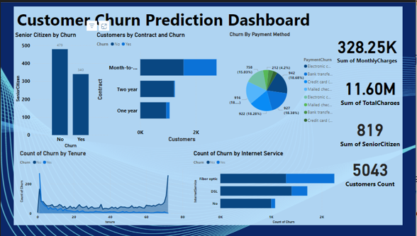

# Customer Churn Prediction Project

## Overview

In this project, we aim to predict customer churn using various machine learning models. By identifying the factors influencing churn, we strive to build a reliable model that provides actionable insights for businesses to enhance their customer retention strategies.

## Models Used

- Logistic Regression
- Random Forest
- K-Nearest Neighbors (KNN)
- Support Vector Machine (SVM)
- Gradient Boosting Machine (GBM)
- Neural Network (MLPClassifier)

## Key Metrics and Success Criteria

1. **Accuracy**: The model should have an accuracy score of at least 80% best at >85%
2. **Precision and Recall**: Achieve at least 80% to ensure reliable churn prediction and identification.
3. **F1 Score**: Minimum of 0.75 to balance precision and recall, especially for imbalanced classes.
4. **AUC-ROC Score**: At least 0.85 to effectively distinguish between churn and non-churn customers.
5. **Confusion Matrix**: Lower the number of False Negatives (FN) to ensure most churn cases are identified.


## Features

- `CustomerID`: A unique customer identification
- `Gender`: Whether the customer is male or female
- `SeniorCitizen`: Whether a customer is a senior citizen or not
- `Partner`: Whether the customer has a partner or not (Yes, No)
- `Dependents`: Whether the customer has dependents or not (Yes, No)
- `Tenure`: Number of months the customer has stayed with the company
- `PhoneService`: Whether the customer has a phone service or not (Yes, No)
- `MultipleLines`: Whether the customer has multiple lines or not
- `InternetService`: Customer's internet service provider (DSL, Fiber Optic, No)
- `OnlineSecurity`: Whether the customer has online security or not (Yes, No, No Internet)
- `OnlineBackup`: Whether the customer has online backup or not (Yes, No, No Internet)
- `DeviceProtection`: Whether the customer has


## Data Preprocessing

### Scaling Decision

- Standard Scaler was disqualified due to non-normal distribution of data.
- MinMax Scaler was disqualified due to the presence of outliers.
- Robust Scaler was chosen to handle biases in the training data.
- Quantile Transformer was used to transform the data to a more evenly distributed shape.

## Feature Engineering

*Numerical and categorical features were processed separately:*

```csharp-interactive


numeric_pipeline = Pipeline(steps=[
    ('imputer', SimpleImputer(strategy='median')),
    ('scaler', RobustScaler()),
    ('QuantileTransformation', QuantileTransformer()),
])

categorical_pipeline = Pipeline([
    ('imputer', SimpleImputer(strategy='most_frequent')),
    ('encoder', OneHotEncoder()),
])

preprocessor = ColumnTransformer(transformers=[
    ('num_pipeline', numeric_pipeline, numerical_columns),
    ('cat_pipeline', categorical_pipeline, categorical_columns),
])
``` 

## **Model Training and Evaluation**

### Initial Training on Imbalanced Data

*Multiple models were trained on imbalanced data:*

- Logistic Regression
- Random Forest
- K-Nearest Neighbors (KNN)
- Support Vector Machine (SVM)
- Gradient Boosting Machine (GBM)
- Neural Network

*The initial results showed a bias towards the majority class ("No" churn)*
*Addressing Class Imbalance*
*SMOTE (Synthetic Minority Over-sampling Technique) was applied to balance the dataset*

#### Model Performance on Balanced Data

| Model              | Accuracy | Precision | Recall  | F1-Score |
|--------------------|----------|-----------|---------|----------|
| KNN                | 0.685828 | 0.757547  | 0.685828| 0.703403 |
| Neural Network     | 0.758176 | 0.774210  | 0.758176| 0.764313 |
| Logistic Regression| 0.753221 | 0.808432  | 0.753221| 0.766126 |
| SVM                | 0.762141 | 0.793921  | 0.762141| 0.771759 |
| GBM                | 0.783944 | 0.801629  | 0.783944| 0.790134 |
| Random Forest      | 0.790882 | 0.791642  | 0.790882| 0.791254 |


#### Key Findings

- All models achieved relatively high accuracy scores (0.686 to 0.791) on balanced data.
- Random Forest performed best in accuracy (0.791) and F1-score (0.791).
- Logistic Regression and GBM showed the highest precision (0.808 and 0.802 respectively).
- Random Forest and GBM achieved the highest recall scores (0.791 and 0.784)

#### Model Comparison and Recommendations

- Random Forest and GBM consistently performed well across all metrics.
- Logistic Regression and SVM demonstrated strong performance with high precision scores.
- Neural Network showed competitive performance but slightly lower precision.
- KNN exhibited the lowest recall among the models.

### Conclusion in Regards to Modeling and Evaluation

- Ensemble methods (Random Forest and GBM) are recommended for their balanced performance across all metrics. They are particularly suitable for applications where F1-score is the primary consideration.


### Hperparameter Tuning 

#### Hyperparameter Tuning Results

#### Gradient Boosting Machine (GBM)

- **Error Handling:** The error messages encountered during trials were due to setting `'max_features': 'auto'`, which is not compatible with `cross_val_score` in scikit-learn. This issue will be addressed in future tuning iterations.

- **Optimization Progress:** Despite encountering errors in some trials, the study completed all 100 trials as specified (`n_trials=100`).

- **Best F1-Score:** The best F1-score observed during the study was **0.794**, achieved in Trial 63, which represents a slight improvement.

#### Random Forest

- **Trial Number:** Trial 99 was the 99th trial conducted during the optimization process.

- **Trial Result:** The F1-score observed for Trial 99 was **0.6353**.

- **Best Trial:** The best F1-score observed overall throughout all trials was **0.6424**, achieved in Trial 40.

- **Performance Drop:** There was a drop in F1 Score from an initial 0.791 to 0.642, indicating a need for further hyperparameter adjustment to enhance performance.

#### Challenges and Moving Forward 

- The only Major Challenge was with the hyperparameter tunings of our 2 best performing models which we will seek to work it out with the best hyperparameters so that we can move forward to sellecting the best model for our test data
- Other Challenges were learning oportnities :blush:
- We will also be exporting core machine learning Components for future use in other projects 

#### Preview into Our Data Visualization Dashboard

 


#### As We Wrap up :tada:

**Summarry**
*This deep and detailed README file gives a step by step understaning and guide over a project titled Customer Churn Prediction. It has project objective, hypothesis testing, analytical questions and instructions with snipets of the project highlighted. It goes an extra mile to give a glimpse of the deployment methods used in this project*

**Acknowledgment**
*lots of appreciation to my tutors at Azubi Africa COHORT 7, My fellow students in DAP7 for being resourceful throughout this journey. Special thanks to team Ireland; an amazing thought provoking and dedicated team to work with*

**How to Contribute to project**
*pull requests are welcome. For major changes, please open an issue first to discuss what you would like to change*

please make sure to update tests as appropriate.
  

